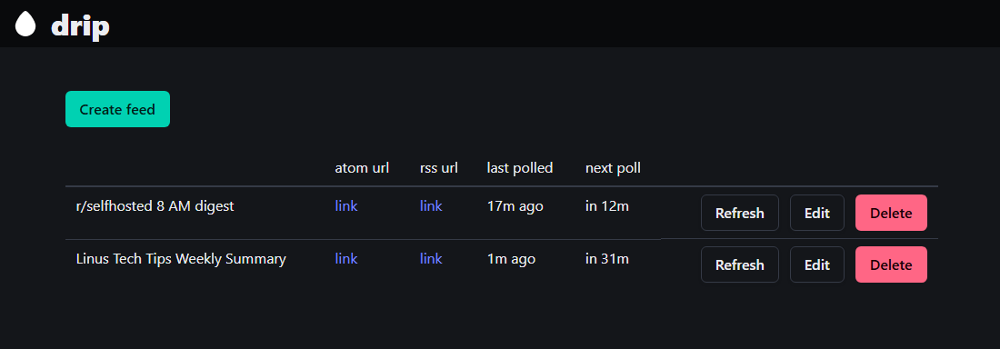
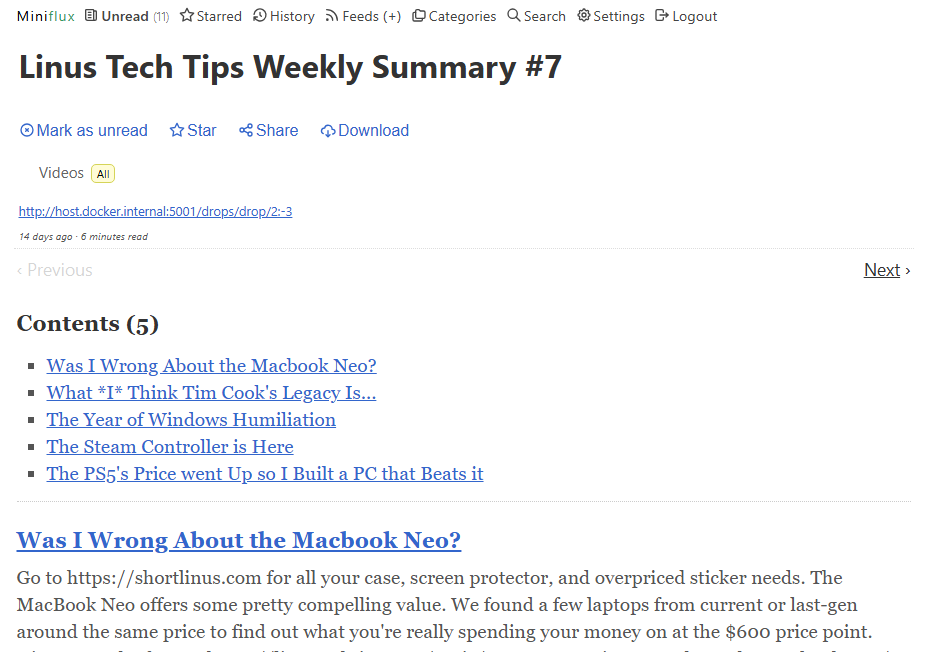
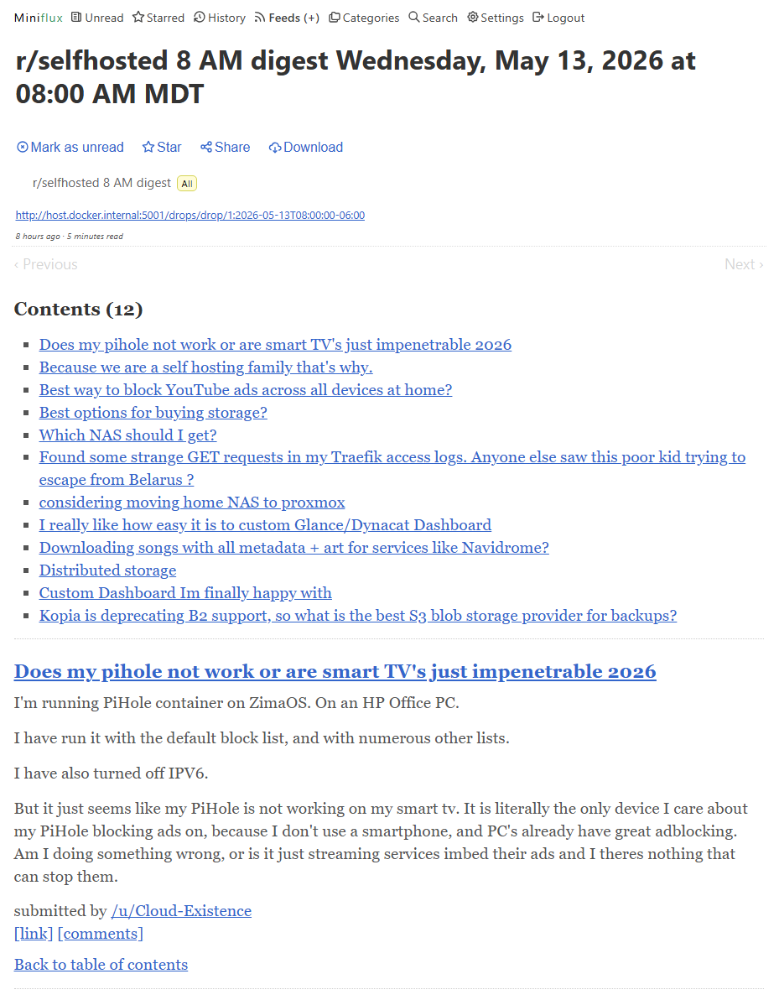

# drip

A tool to aggregate noisy RSS feeds into scheduled digests.

<details>
<summary>Expand for screenshots</summary>



<i>Create feeds</i>

<br>



<i>Timespan-based feed (viewed in <a href="https://miniflux.app/">miniflux</a>)</i>

<br>



<i>Cron-based feed (viewed in <a href="https://miniflux.app/">miniflux</a>)</i>

</details>

## How it works

drip acts as an intermediary between your RSS reader and your RSS feeds. drip will consume from the upstream feed regularly, and emit to the downstream feed according to the configured digest period.

## Running

```bash
docker run -d \
  -p 5001:5001 \
  haumea/drip
```

## Configuration

drip is configured with environment variables. The only ones you probably need to worry about are

- `DRIP_BASE_URL`: Optional, public url for drip to link entries to
- `DRIP_MAX_DROPS`: Maximum number of entries to keep in the output feed

<details>
<summary>Expand to see all environment variables</summary>

| Variable                            | Default         | Description                                           |
| ----------------------------------- | --------------- | ----------------------------------------------------- |
| `DRIP_BASE_URL`                     | —               | Public URL of this instance, used in feed entry links |
| `DRIP_DB_PATH`                      | `/data/drip.db` | Path to SQLite database                               |
| `DRIP_ENVIRONMENT`                  | `prod`          | Set to `dev` for auto-reload                          |
| `DRIP_SERVER_PORT`                  | `5001`          | Port to listen on                                     |
| `DRIP_LOG_LEVEL`                    | `INFO`          | Log level                                             |
| `DRIP_LOG_TEMPLATE`                 | —               | Log format string                                     |
| `DRIP_MAX_DROPS`                    | `10`            | Number of digest episodes to retain per feed          |
| `DRIP_NAMESPACE_UUID`               | `60a76c80-...`  | UUID namespace for stable feed/entry IDs              |
| `DRIP_FEED_READ_TIMEOUT`            | `30s`           | HTTP timeout for upstream feed requests               |
| `DRIP_FEED_READ_DEFAULT_INTERVAL`   | `15m`           | Starting poll interval for new feeds                  |
| `DRIP_FEED_READ_MIN_INTERVAL`       | `5m`            | Minimum poll interval                                 |
| `DRIP_FEED_READ_MAX_INTERVAL`       | `24h`           | Maximum poll interval                                 |
| `DRIP_FEED_READ_BACKOFF_FACTOR`     | `2.0`           | Interval multiplier on empty polls                    |
| `DRIP_FEED_READ_ACCEL_FACTOR`       | `0.5`           | Interval multiplier on new items                      |
| `DRIP_FEED_READ_JITTER_FACTOR`      | `0.2`           | ±jitter applied to poll interval                      |
| `DRIP_FEED_READ_TICK_RATE`          | `30s`           | How often the scheduler checks for due polls          |
| `DRIP_FEED_EMPTY_BACKOFF_THRESHOLD` | `3`             | Consecutive empty polls before backing off            |

</details>

## Usage

1. Open the web UI at http://localhost:5001
2. Click "Create feed"
3. Add a feed URL and a digest period. The period can be a timespan (e.g. `6h`), or a cron schedule (e.g. `0 8 * * *`)
4. Click "Save" and "Return"
5. Subscribe to the generated `.atom` or `.rss` URL in your feed reader

## Development

```bash
just dev
```

Requires [uv](https://github.com/astral-sh/uv) and [just](https://github.com/casey/just).
